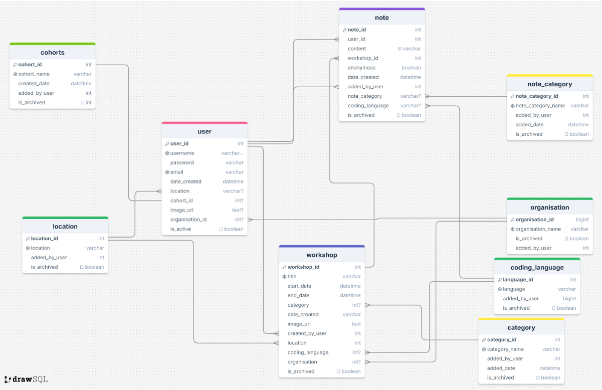
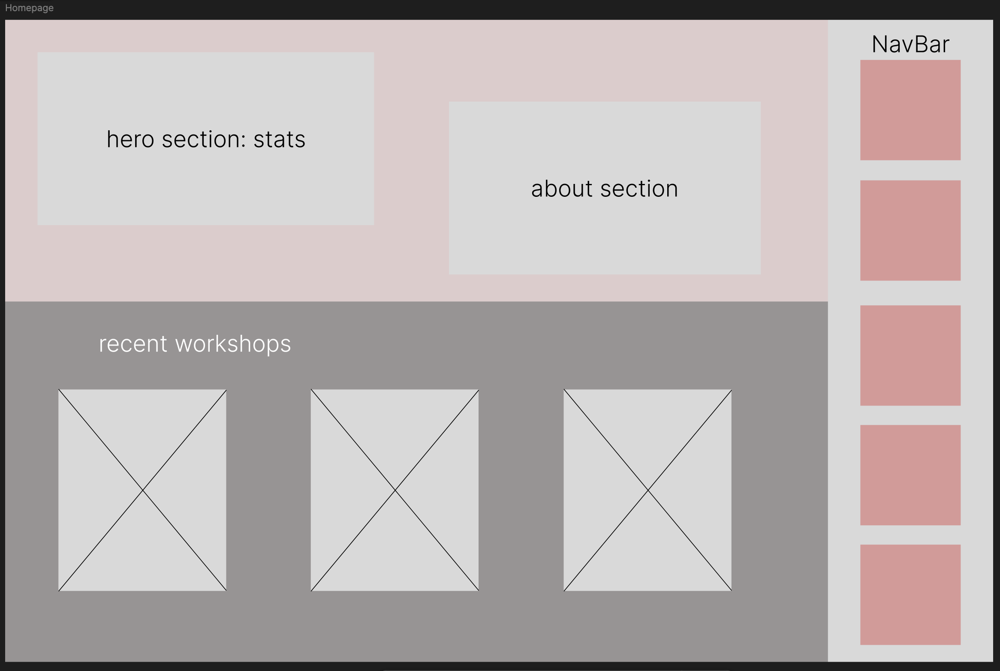
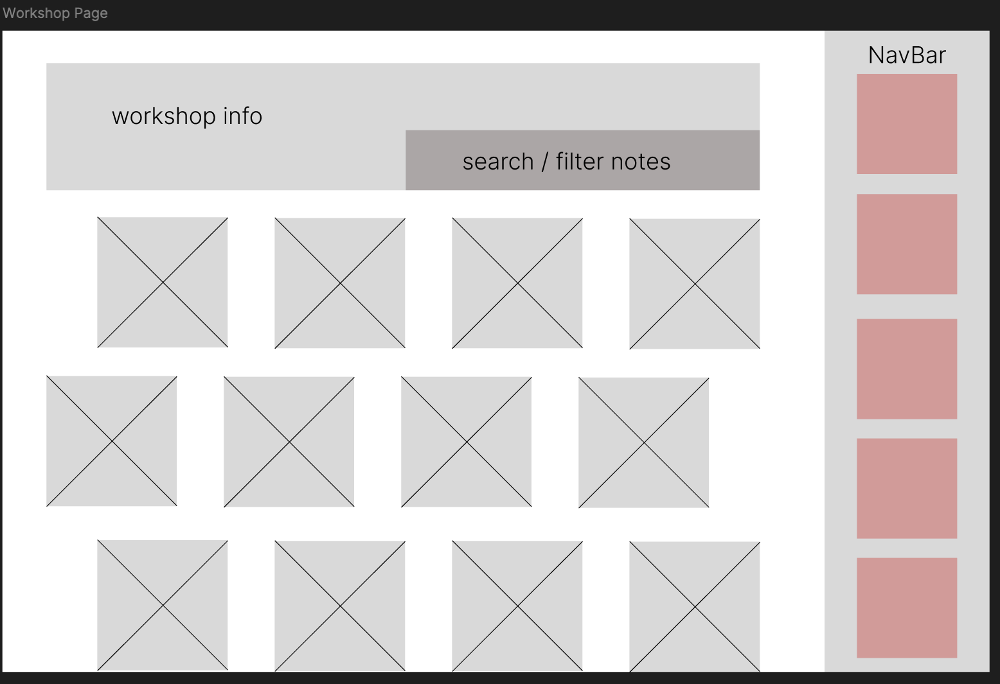
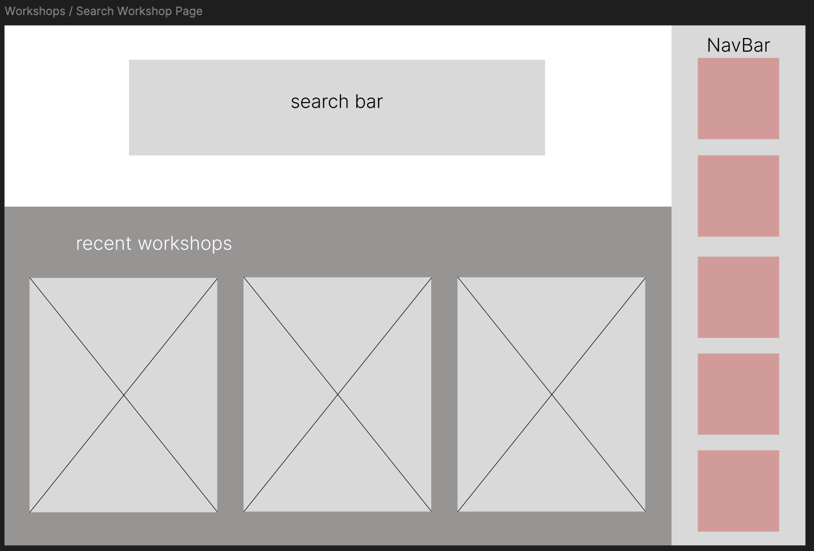
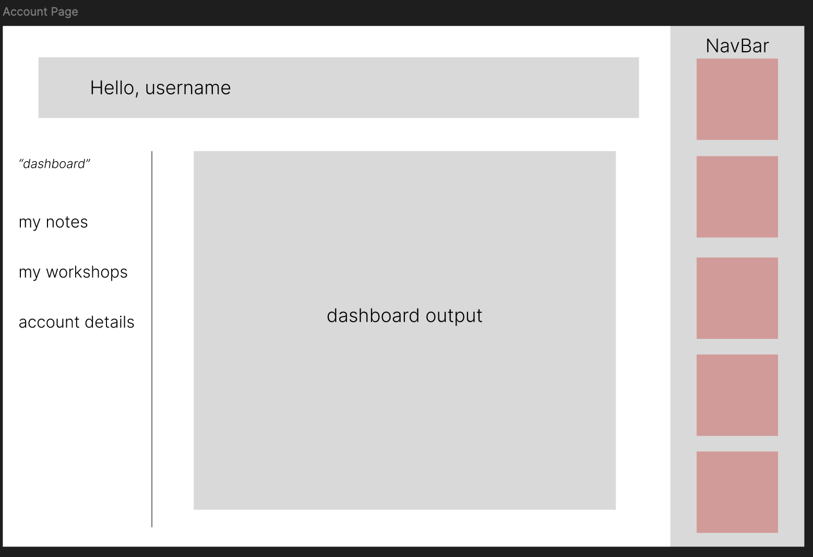
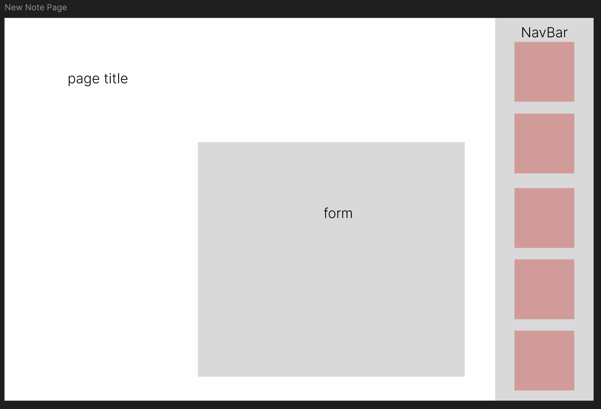
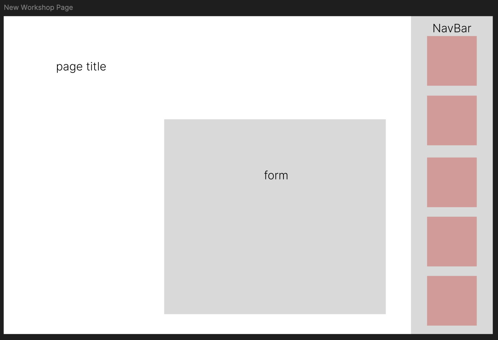
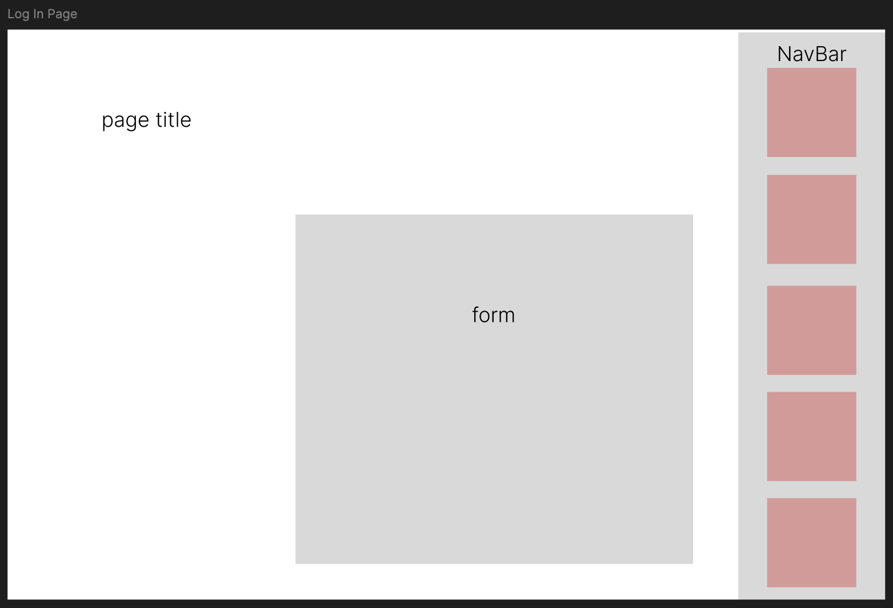
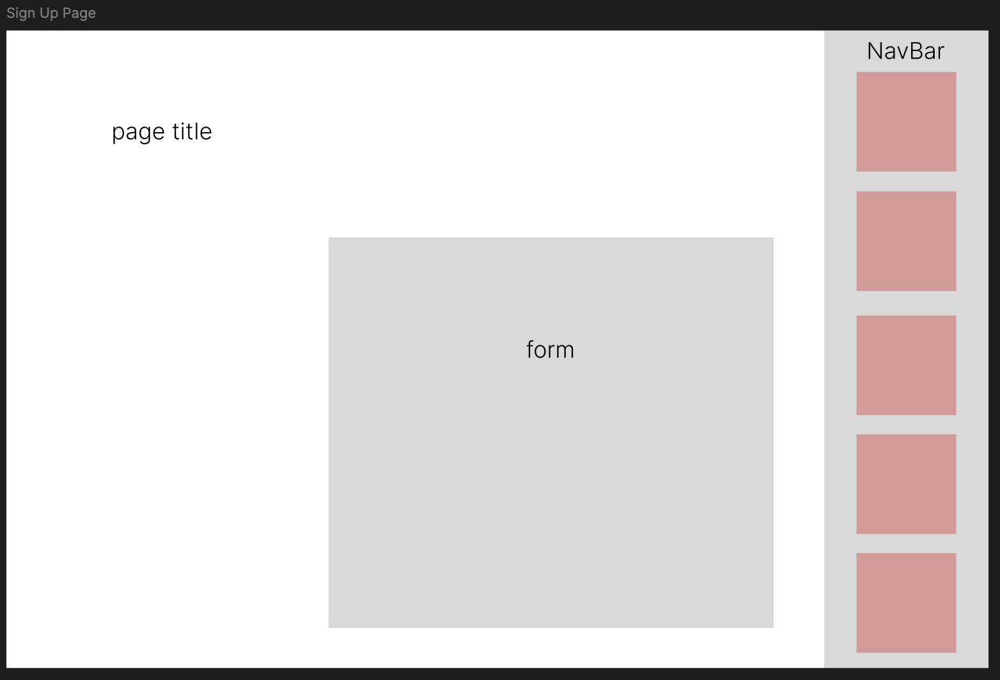

# post-IT-ivity
### By the Quantum Quokkas
- Sandra M
- Tenille S
- Laura S
- Roda A
- Caitlin A

## Table of Contents

  - [Mission Statement](#mission-statement)
  - [Features](#features)
    - [Summary](#summary)
    - [Users](#users)
    - [Post It Notes](#post-it-notes)
    - [Pages/Endpoint Functionality](#pagesendpoint-functionality)
    - [Nice To Haves](#nice-to-haves)
  - [Technical Implementation](#technical-implementation)
    - [Back-End](#back-end)
    - [Front-End](#front-end)
    - [Git \& Deployment](#git--deployment)
  - [Target Audience](#target-audience)
  - [Back-end Implementation](#back-end-implementation)
    - [API Specification](#api-specification)
    - [Object Definitions](#object-definitions)
      - [Users](#users-1)
      - [Post It Notes](#post-it-notes-1)
    - [Database Schema](#database-schema)
  - [Front-end Implementation](#front-end-implementation)
    - [Wireframes](#wireframes)
      - [Home Page](#home-page)
      - [Collection List Page](#collection-list-page)
    - [Logo](#logo)
    - [Colours](#colours)
      - [Primary](#primary)
      - [Secondary](#secondary)
    - [Font](#font)

## Mission Statement

Postitivity empowers She Codes learners to celebrate their coding journey by capturing, sharing, and preserving their musings via a stick it note in a collaborative digital space. Our platform transforms fleeting moments of achievement into lasting inspiration, fostering a supportive community where every step forward is acknowledged and celebrated. Through seamless real-time sharing and intuitive documentation, we help students recognize that their collective small victories build the foundation for lasting success in tech.

## Features

### Summary 
Users and admins will be able to add notes and information via preset fields, they can search other users notes and comment on them.  Data will only be able to be deleted via superusers, all other data will be archived or ‘soft deleted’.

### Users

| Type               | Access                                                                                                                                                                                                                                                                                             | Role type assignment                                |
| :----------------- | :------------------------------------------------------------------------------------------------------------------------------------------------------------------------------------------------------------------------------------------------------------------------------------------------- | :-------------------------------------------------- |
|     Superuser     |   - All access     - Log in    - Log out    - Create and manage workshops    - Manage other users    - Approve, archive and edit(owned) notes    - Edit/archive/delete workshops    - View and edit their details via account page   - Add locations for workshops   - Add organisations that can create workshops   - All basic user functionality       |    ??    |
|     Admin         |   - Log in    - Log out    - Approve, archive and edit(owned) notes   - Create workshops   - Edit/archive owned workshops   - Archive/delete notes in owned workshops   - Post notes for other users in owned workshops   - View and edit their details via account page   - All basic user functionality      |     Mentors, volunteers, staff     |
|     User          |   - Log in   - Log out   - Create and submit post it notes    - Choice post note anonymously   - Edit/archive owned notes   - View and edit their details via account page   - View workshops board with related post it notes       |       Public: Users who attend workshops      |

### Post-It Notes

| Feature                                        | Access                                                                                                                                                                                                           | Notes/Conditions                                                                                              |
| :--------------------------------------------- | :--------------------------------------------------------------------------------------------------------------------------------------------------------------------------------------------------------------- | :------------------------------------------------------------------------------------------------------------ |
|   Create   | Can be created by anyone logged in                                                                                                                                                                    |   - Limit length of sticky note text  |
| Post                                           | Post as user or anonymously                                                                                                                                                           |   - Submits post it note to workshops  |
|   View  | Can be viewed by anyone with the URL                                                                                |                                                                                                               |
|   Edit  | Can be edited by owner of notes                                                                                                                                                                             |   - Edit sticky note text, eg: for spelling errors                       |
| Statuses: Active, Archived | Posted notes will be active by default | - Anyone can archive a note they own   - Owners of a workshops can archive/delete notes posted on it                                                                                                                               |
| Example  |  Access    | - Notes/Conditions                                                                            
                               
### Pages/Endpoint Functionality

| Endpoint              | functionality                                                                                                                                                                     | comments                                                                                         |
| :-------------------- | :-------------------------------------------------------------------------------------------------------------------------------------------------------------------------------- | :----------------------------------------------------------------------------------------------- |
| Create and post notes |   - Available to anyone logged into to an account     - Add post it notes     - Submit post it notes                                                                                          | - Comments here |
| Workshops board           |   - Once note is posted, redirect to page of the workshop    - Able to post more notes (redirect back or add directly?)    - Post it notes can be added to a workshop up to 1 month after the workshop |    - search notes by text                                      |
| Admin page            | All admin functions    - can also create another admin account                                                                                                                 |   - Requires auth    - initial admin created by DB                                         |
| Register as Approver  |   - users can register as approvers    - once registered, approver can log in                                                                                               | Requires shecodes email address to be used                                                       |
| Approver page         | Approver functions                                                                                                                                                                | Requires auth Easy to read, accessible, easy to use for new users                                |
| Profile page          |   - All registered users    - Can view their personal info    - Can update their info                                                                                    | Requires auth                                                                                    |

### Nice To Haves

- Be able to "like/heart" a post it note
- Ability for superuser or workshop owner admin to contact user via their post it note (e.g. if the note was not positive, be able to reach out to them for more feedback)
- Register to workshops
- View workshops that the logged in user has checked as attending
- View past attended workshops

## Technical Implementation

### Back-End

- Django / DRF API
- Python

### Front-End

- React / JavaScript
- HTML/CSS

### Git & Deployment
- Heroku
- Netlify
- GitHub

This application's back-end will be deployed to Heroku. The front-end will be deployed separately to Netlify.
 
We will also use Insomnia to ensure API endpoints are working smoothly (we will utilise a local and deployed environment in Insomnia).

## Target Audience

> [!NOTE]  
> Who is the website for? (approx 100 words).
>   TO BE COMPLETED

## Back-end Implementation

[!NOTE]
> This is still Winwall's example code here

### API Specification

| HTTP Method | URL                                 | Purpose                                                                                                                                  | Request Body                                                                                                       | Successful Response Code | Authentication and Authorization                      |
| :---------- | :---------------------------------- | :--------------------------------------------------------------------------------------------------------------------------------------- | :----------------------------------------------------------------------------------------------------------------- | :----------------------- | :---------------------------------------------------- |
| POST        | /login                              | Allow users to log in                                                                                                                    | ““Username”:”string”, “password”:”string”                                                                          | 200                      | Token auth                                            |
| POST        | /logout                             | Allow users to log out ( end active session)                                                                                             | ““Username”:”string”, “password”:”string”                                                                          | 200                      | Will clear user log in session \- remove stored token |
| POST        | /Register                           | Create new student or approver user                                                                                                      | “Username”:”string”, “FullName”: “string” “Email”:”string”,”Password”:”string”, ”Password2”:”string”,              | 201                      | Admin                                                 |
| PUT         | /Profile/ID                         | Edit user                                                                                                                                | “Username”:”string”, “FullName”: “string” “Email”:”string”, “Avatar”:”string”,  “Bio”:”string”, “Socials”:”string” | 200                      | Admin, approver or student with matching ID           |
| GET         | /Profile/ID                         | View User profile                                                                                                                        | NA                                                                                                                 | 200                      | Any                                                   |
| DELETE      | /User/ID                            | Delete user                                                                                                                              | NA                                                                                                                 | 204                      | Admin, approver or student with matching ID           |
| POST        | /EventCollection                    | Create new Event Collection                                                                                                              | “Title”:”string”, “IsExported”:”boolean” “Approver”: integer                                                       | 201                      | Admin                                                 |
| PUT         | /EventCollection/Id                 | Update Event collection                                                                                                                  | “Title”:”string”, “IsExported”:”boolean”                                                                           | 200                      | Admin, Approver linked to event?                      |
| DELETE      | /EventCollection/Id                 | Delete Event collection                                                                                                                  | NA                                                                                                                 | 204                      | Admin                                                 |
| POST        | /EventBoard/                        | Create new Event board                                                                                                                   | “Title”: “string”, “StartDate”:”datetime”, “EndDate:”datetime”                                                     | 201                      | Admin, approvers                                      |
| PUT         | /EventBoard/ID                      | Update Event board                                                                                                                       | “Title”: “string”, “StartDate”:”datetime”, “EndDate:”datetime”                                                     | 200                      | Admin, approvers                                      |
| DELETE      | /EventBoard/ID                      | Delete Event board                                                                                                                       | NA                                                                                                                 | 204                      | Admin or author of event                              |
| GET         | /EventBoard/ID                      | Get Event board details                                                                                                                  | NA                                                                                                                 | 200                      | Open access                                           |
| POST        | /stickyNote/                        | Create a new sticky note as Guest user                                                                                                   | “WinComment”:”string”                                                                                              | 201                      | Open access                                           |
| GET         | /stickyNotes/?Status=Live\&Event.ID | Get Sticky notes for an event  Use query params to filter by event ID and Status                                                         | NA                                                                                                                 | 200                      | Open access                                           |
| GET         | /stickyNotes/?Event.ID              | Get Sticky notes for an event                                                                                                            | NA                                                                                                                 | 200                      | Admin, approvers                                      |
| GET         | /stickyNotes/                       | Export sticky notes as CSV (eg:response.setContentType("text/csv")) Can optionally filter by: event ID, Status, isexported, collectionId | NA                                                                                                                 | 200                      | Admin                                                 |
| PUT         | /stickyNotes/ID                     | Edit sticky note, update status of sticky note to Approved or Archived                                                                   | “WinComment”:”string”                                                                                              | 200                      | Admin, approvers                                      |
| POST        | /StickyStatus                       | Create available statuses for stickyNotes                                                                                                | “StatusName”:”string”                                                                                              | 201                      | Admin                                                 |
| GET         | /StickyStatus                       | Get all statuses                                                                                                                         | NA                                                                                                                 | 200                      | Admin                                                 |

### Object Definitions

> [!NOTE]  
> Define the actual objects that your API returns. The example GET method above says it returns “all projects”, so we need to define what a “project” looks like. Example below.

#### Users
| Field              | Data type |
| :----------------- | :-------- |
| *User\_ID (PK)*    |           |
| *Username*         | string    |
| FullName           | string    |
| *Email*            | string    |
| *Password*         | string    |
| *Password2*        | string    |
| Auth\_ID (FK)      | integer   |
| StickyNoteId (FK)  | integer   |
| Event\_Id (FK)     | integer   |
| Collection\_Id(FK) | integer   |
| Avatar             | string    |
| Bio                | string    |
| SocialLink         | string    |

#### Post-It Notes
| Field                   | Data Type |
| :---------------------- | :-------- |
| Sticky\_ID (PK)         | integer   |
| WinComment              | string    |
| Guest                   | boolean   |
| UserId (FK)             | integer   |
| Event\_Id (FK)          | integrer  |
| Collection\_Id (FK)     | integrer  |
| Sticky\_Status\_ID (FK) | integrer  |

> [!NOTE]  
> ... etc

### Database Schema

## Front-end Implementation

### Wireframes

#### Home Page

#### Workshop Page

#### Workshops / Search Workshop Page

 
#### Account Page

 
#### Post a Note Page

 
#### Create Workshop Page

 
#### Login Page

 
#### Sign Up Page

### Logo
- add logo here

### Colours

#### Primary
- headings/subheadings
- add image of colour
#### Secondary
- text
- add image of colour

#### Accent
- buttons/links
- add image of colour

#### Base Dark
- text
- add image of colour

#### Base Light
- background
- add image of colour

### Fonts

#### Primary Font
- headings, subheadings, links, buttons
- add image of font

#### Secondary Font
- body text (about sections etc)
- post it notes
- add image of font
